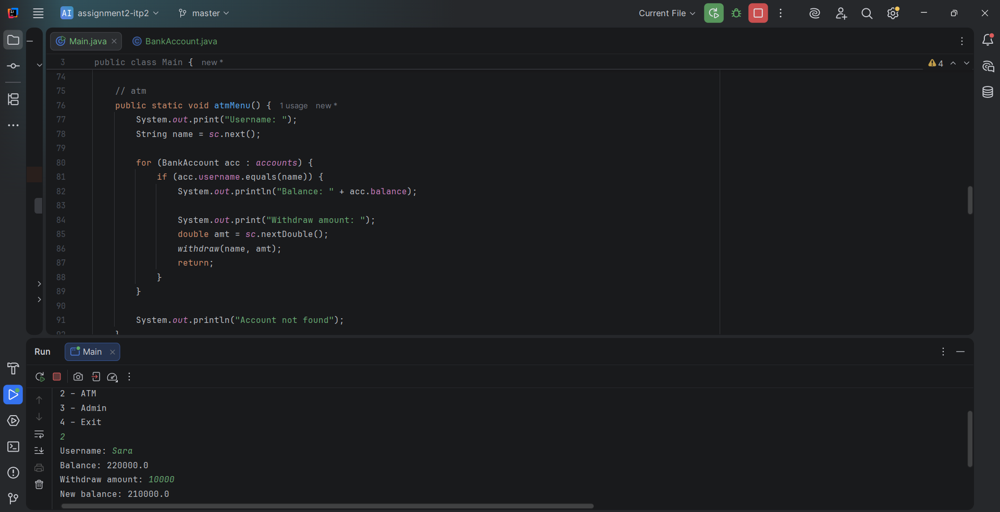
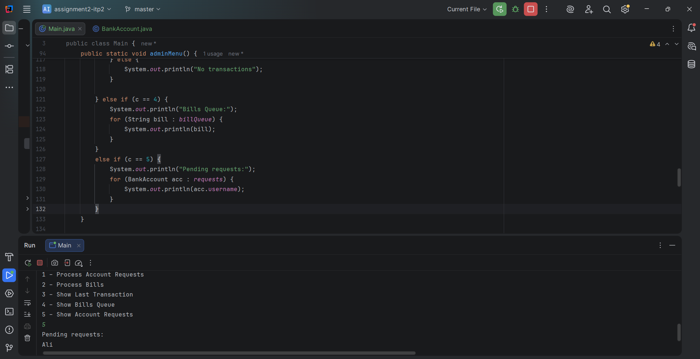
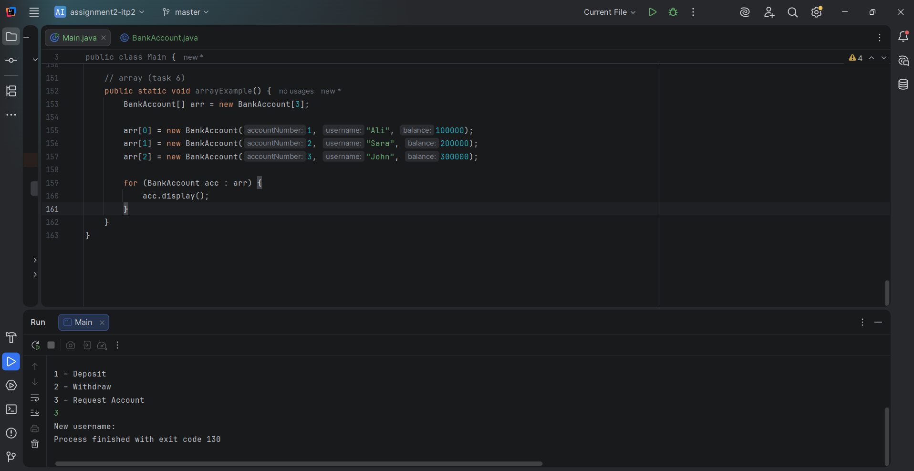

# Assignment 1 - Physical & Logical Data Structures (Banking System)

##  
Name: Ismail Bolat
Group: SE-2512

---

# Task 1: Bank Account Storage Using LinkedList
Bank options: deposit, withdraw, request new account, pay bill.

### 

---

# Task 2: Deposit & Withdraw Operations
Adds money to the specified user’s account

### 

---

# Task 3: Transaction History (Stack – LIFO)
Stores and shows transaction history

### 

---

# Task 4: Bill Payment Queue (Queue – FIFO)
Shows bill payment queue

###

---

# Task 5: Account Opening Queue (Admin Simulation)
ATM interface: shows user balance and allows withdrawal

###

---

# Task 6: 

### 

---

# Part 3:
Main menu for choosing Bank, ATM, Admin, or Exit

### 

---

